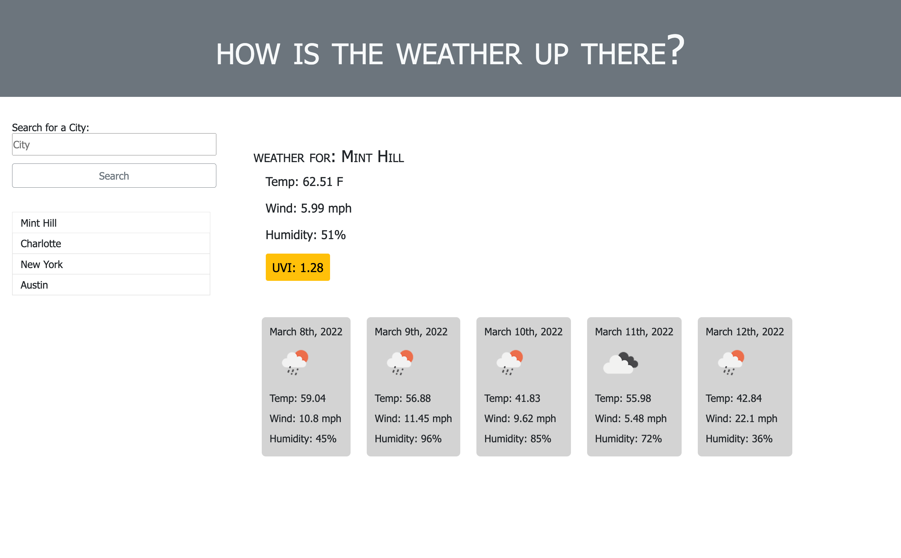

# Weather Dashboard

[Weather] (https://magdalenaperry.github.io/weather-channel/)

## Table of Contents
1. [Description](#Description)
2. [Visuals](#Visuals)
3. [Usage](#Usage)
4. [Visuals](#Visuals)

## Description
This is a weather application designed with bootstrap, momentum, and javascript. The weather information displayed on the app comes from the Open Weather: One Call API, and GeoCoding API.

## Usage
When the app is deployed a search input field and button appear to type in a city name. If the city is a valid city name, the current weather and a five day forecast with weather icons will be displayed.

## Visuals

